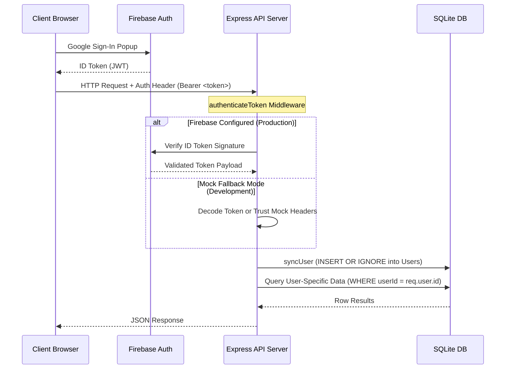

# ExpenseTracker

ExpenseTracker is a comprehensive, full-stack, and responsive expense management application. It is designed to help users log daily transactions, monitor recurring monthly subscriptions, track loans with fixed EMIs, and manage peer-to-peer debts (money lent to or borrowed from friends). 

The project uses a **React (Vite) frontend** and an **Express.js backend** backed by a **SQLite database**, securing data access with **Firebase Authentication (Google Sign-In)** and fallback development modes.

---

## Table of Contents
1. [Core Features](#core-features)
2. [Tech Stack](#tech-stack)
3. [Project Architecture & Directory Layout](#project-architecture--directory-layout)
4. [Database Schema](#database-schema)
5. [Authentication & Verification Flow](#authentication--verification-flow)
6. [Getting Started (Local Development)](#getting-started-local-development)
7. [Deployment & Environment Configuration](#deployment--environment-configuration)

---

## Core Features

### 1. Dashboard & Premium Analytics
* **Interactive SVG Charts**: Responsive donut chart for category allocations and side-by-side comparative bar chart representing Total Income vs. Total Expenses.
* **Display Currency Converter**: Dynamic currency selector at the top-right that converts all stats, lists, and graphs into selected standard currencies ($ / € / £ / ₹ / ¥).
* **Quick Log**: Log expenses with details such as description, amount, category, date, and specific **Mode of Transaction** (UPI apps: Google Pay, PhonePe, Paytm, or Cash/Card/Net Banking).
* **Custom Category Budgets**: Set custom monthly budget limits directly inline (defaulting to ₹1000) with color-changing progress bars.
* **History Feed**: Browse entries in a tabular layout with color-coded transaction method badges.

### 2. Income Tracker
* **Multiple Incomes Logging**: Log various income streams (Salary, Freelance, Investments) with standard currencies.
* **Financial Health Indicators**: Computes Net Savings amount and Net Savings Rate percentages based on total income vs. total expense ratios.

### 3. Recurring Subscriptions Tracker
* **Monthly Burn Rate**: See your total monthly recurring financial commitments at a glance.
* **Brand Recognition**: Dynamic logo loading via Clearbit Logo API mapped to official domains (e.g. Netflix, Apple, Spotify, Amazon Prime), with automatic fallback to Google's Favicon Service or a custom Lucide fallback icon on loading errors.
* **Flexible Billing**: Track exact billing cycle dates (1st–31st of the month).
* **Dynamic Currency Selector**: Fetches all active global currencies from the Frankfurter API, formatting options as "USD - US Dollar" and defaulting to INR, with automatic local fallback (USD, EUR, GBP, INR, JPY) on load errors.
* **Edit/Delete Actions**: Modify existing subscriptions inline using custom dialog states.

### 4. Loan & EMI Tracker
* **Structured Debt Registry**: Track auto loans, mortgages, or personal loans by registering the principal amount, fixed monthly EMI, and final payoff date.
* **Visual Progress Bars**: Repayment progress indicators based on elapsed loan duration.
* **Payoff Forecasting**: Real-time remaining balance calculations.

### 5. Friends & Debts Tracker
* **Two-way Ledger**: Track who owes whom by marking transactions as **Lent** (they owe you) or **Borrowed** (you owe them).
* **Net Balance Calculations**: Sums outstanding balances across currencies. Color-coded signals immediately show if you are in the green (net lender) or red (net borrower).
* **Modern Custom Calendar**: Uses a custom, interactive calendar dropdown instead of standard browser picker controls.
* **Approximate Dates Option**: Checkbox to designate "approximate date" when you don't recall the exact date of a historical peer-to-peer transaction.
* **Tabs & Settlement History**: Separate active transactions from settled history. A simple toggle lets users mark debts as settled or re-open them.

---

## Tech Stack

### Frontend (Client)
* **Framework**: React 18 (Vite-based build toolchain)
* **Routing**: React Router DOM (v6) for seamless sidebar navigation
* **Icons**: Lucide React & React Icons (Simple Icons, FontAwesome)
* **Styling**: Modern, fluid CSS3 utilizing CSS variables, responsive grids, custom scrollbars, and media-query break-points optimized for Desktop and Mobile/Tablet screens.
* **Auth**: Firebase Client SDK (Google Auth popup provider).

### Backend (API Server)
* **Runtime**: Node.js with Express.js
* **Database**: SQLite (via `sqlite3` driver)
* **Security & Auth**: Firebase Admin SDK (`firebase-admin`) for token decoding & verification.
* **CORS**: Enabled globally via `cors` middleware.

---

## Project Architecture & Directory Layout

The application separates concerns clearly between the frontend interface and the backend API service:

```text
expense-tracker/
├── index.html                  # Main HTML entrypoint for Vite
├── package.json                # Frontend package dependencies & scripts
├── vite.config.js              # Vite bundler configuration
├── server/                     # Backend API Server folder
│   ├── index.js                # Express app, SQLite schemas & routes
│   ├── database.sqlite         # SQLite database file (git-ignored)
│   ├── package.json            # Server package dependencies & scripts
│   └── serviceAccountKey.json  # Firebase Admin Private Key (git-ignored)
└── src/                        # React Frontend Source Code
    ├── main.jsx                # Application root mounting file
    ├── index.css               # Global styling system & theme variables
    ├── firebase.js             # Firebase client-side SDK configuration
    ├── App.jsx                 # Core routing, Auth state listener & structure
    └── components/             # Reusable UI Page Components
        ├── Sidebar.jsx         # Desktop sidebar navigation & Mobile bottom nav
        ├── Dashboard.jsx       # Daily expenses dashboard
        ├── Subscriptions.jsx   # Recurring subscription list & CRUD form
        ├── Loans.jsx           # Loan list, EMI metrics & progress bars
        └── Debts.jsx           # Peer-to-peer debts system with custom picker
```

---

## Database Schema

The backend uses a single SQLite file (`server/database.sqlite`) initialized dynamically on startup with the following tables:

### 1. `users`
Tracks authenticated users synchronized from Firebase UIDs:
* `id` (TEXT, Primary Key) — Matches Firebase UID (`uid`).
* `email` (TEXT)
* `name` (TEXT)

### 2. `expenses`
Stores individual itemized transactions:
* `id` (TEXT, Primary Key) — Generated on frontend via `crypto.randomUUID()`.
* `userId` (TEXT, Foreign Key) — References `users(id)`.
* `description` (TEXT)
* `amount` (REAL)
* `currency` (TEXT)
* `category` (TEXT)
* `date` (TEXT) — Date string formatted as `YYYY-MM-DD`.
* `paymentMode` (TEXT) — E.g. 'Google Pay', 'Cash', etc.

### 3. `subscriptions`
Stores monthly subscription records:
* `id` (TEXT, Primary Key)
* `userId` (TEXT, Foreign Key) — References `users(id)`.
* `brand` (TEXT) — Name of service.
* `amount` (REAL)
* `currency` (TEXT)
* `billingDay` (INTEGER) — Int values between 1 and 31.

### 4. `loans`
Stores registered loans:
* `id` (TEXT, Primary Key)
* `userId` (TEXT, Foreign Key) — References `users(id)`.
* `name` (TEXT) — Description/Name of the loan.
* `totalAmount` (REAL)
* `emiAmount` (REAL) — Monthly payment size.
* `currency` (TEXT)
* `endDate` (TEXT) — Payoff date string.

### 5. `debts`
Stores peer-to-peer debt ledger details:
* `id` (TEXT, Primary Key)
* `userId` (TEXT, Foreign Key) — References `users(id)`.
* `friendName` (TEXT)
* `amount` (REAL)
* `currency` (TEXT)
* `date` (TEXT) — Transaction date (or the literal string `'approximate'`).
* `type` (TEXT) — `'lent'` or `'borrowed'`.
* `status` (TEXT) — `'pending'` or `'settled'`.
* `createdAt` (TEXT) — ISO timestamp generated at creation.

### 6. `budgets`
Stores user-defined monthly category limits:
* `userId` (TEXT, Primary Key, Foreign Key) — References `users(id)`.
* `category` (TEXT, Primary Key)
* `limitAmount` (REAL)

---

## Authentication & Verification Flow

To ensure data isolation between multiple users, the application secures all endpoints.



### Guest Access & Dev Fallbacks
1. **Guest Preview Mode**: For privacy-focused users or portfolio reviewers, a one-click "Explore as Guest" mode issues a temporary mock session using local storage persistence, which bypasses Firebase verification at the database API level.
2. **Development Mock Auth**: If Firebase client initialization fails or the server does not find `server/serviceAccountKey.json` on boot, it falls back to a development simulation mode, allowing full local feature evaluation without cloud configurations.

---

## Getting Started (Local Development)

### 1. Prerequisites
Ensure you have [Node.js](https://nodejs.org/) installed.

### 2. Configure Firebase (Optional)
If you want to use real Firebase Google Auth instead of Mock mode:
1. Create a Firebase project in the [Firebase Console](https://console.firebase.google.com/).
2. Enable **Google Authentication** under *Build > Authentication > Sign-in method*.
3. Add an app to the project (Web app) and copy the firebase configuration options. Replace the configuration block in [src/firebase.js](file:///Users/cherry/Documents/expense-tracker/src/firebase.js).
4. Register your local hostname (e.g. `localhost`) under *Authorized Domains* in Firebase.
5. Generate a private key for your Firebase Service Account from *Project Settings > Service accounts* and save the downloaded file as `serviceAccountKey.json` inside the [server/](file:///Users/cherry/Documents/expense-tracker/server) directory.

### 3. Run the Backend API Server
Navigate to the server directory, install dependencies, and start the development server:
```bash
cd server
npm install
npm start
```
The server will bind to port `3001` (`http://localhost:3001`).

### 4. Run the React Frontend
Navigate to the project root directory in a separate terminal, install dependencies, and run the Vite bundler:
```bash
npm install
npm run dev
```
Open the output URL (usually `http://localhost:5173`) in your browser to interact with the application.

---

## Deployment & Environment Configuration

* **Environment Variables**: Configure the API port and backend URL targets dynamically using environment configs if deploying to server instances.
* **Production Build**: Generate the static web assets by running `npm run build` in the root folder, and serve the resulting `dist/` directory via any standard CDN, static web host, or Express static middleware.
* **SQLite Persistence**: Ensure persistent volume mounts for `server/database.sqlite` when deploying containerized (e.g. Docker) instances of the backend.
